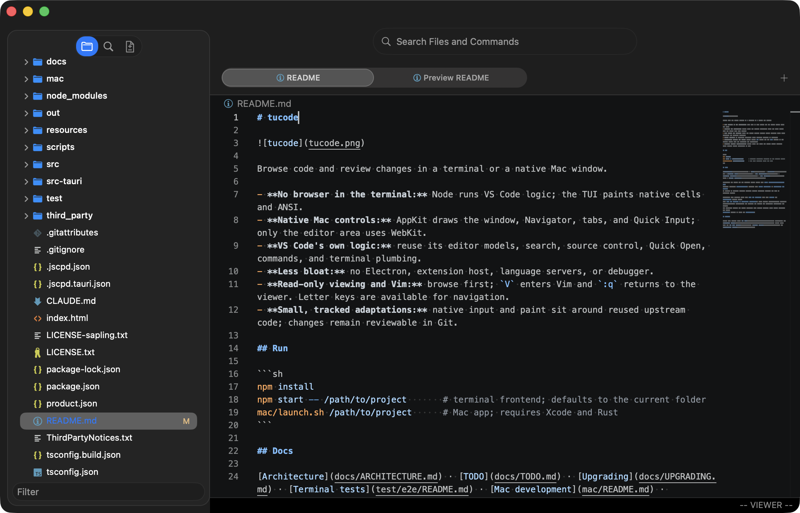
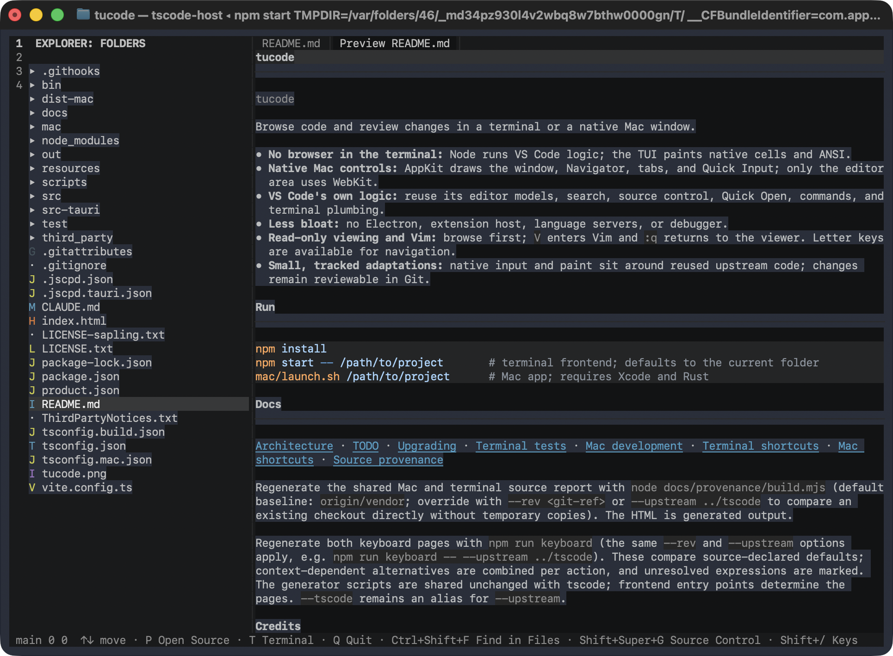

# tucode





Browse code and review changes in a terminal or a native Mac window.

- **No browser in the terminal:** Node runs VS Code logic; the TUI paints native cells and ANSI.
- **Native Mac controls:** AppKit draws the window, Navigator, tabs, and Quick Input; only the editor area uses WebKit.
- **VS Code's own logic:** reuse its editor models, search, source control, Quick Open, commands, and terminal plumbing.
- **Less bloat:** no Electron, extension host, language servers, or debugger.
- **Read-only viewing and Vim:** browse first; `V` enters Vim and `:q` returns to the viewer. Letter keys are available for navigation.
- **Small, tracked adaptations:** native input and paint sit around reused upstream code; changes remain reviewable in Git.

## Run

```sh
npm install
npm start -- /path/to/project       # terminal frontend; defaults to the current folder
mac/launch.sh /path/to/project      # Mac app; requires Xcode and Rust
```

## Docs

[Architecture](docs/ARCHITECTURE.md) · [TODO](docs/TODO.md) · [Upgrading](docs/UPGRADING.md) · [Terminal tests](test/e2e/README.md) · [Mac development](mac/README.md) · [Terminal shortcuts](docs/keyboard/terminal.html) · [Mac shortcuts](docs/keyboard/mac.html) · [Source provenance](docs/provenance/provenance.html)

Regenerate the shared Mac and terminal source report with `node docs/provenance/build.mjs`
(default baseline: `origin/vendor`; override with `--rev <git-ref>` or `--upstream ../tscode`
to compare an existing checkout directly without temporary copies). The HTML is generated output.

Regenerate both keyboard pages with `npm run keyboard` (the same `--rev` and `--upstream` options apply,
e.g. `npm run keyboard -- --upstream ../tscode`). These compare source-declared defaults;
context-dependent alternatives are combined per action, and unresolved expressions are marked.
The generator scripts are shared unchanged with tscode; frontend entry points determine the pages.
`--tscode` remains an alias for `--upstream`.

## Credits

Forked from tscode, using [VS Code](https://github.com/microsoft/vscode) (Microsoft) and [Sapling's addons](https://github.com/facebook/sapling/tree/main/addons) (Meta) under MIT; see [VS Code license](LICENSE.txt), [Sapling license](LICENSE-sapling.txt), and [third-party notices](ThirdPartyNotices.txt).
